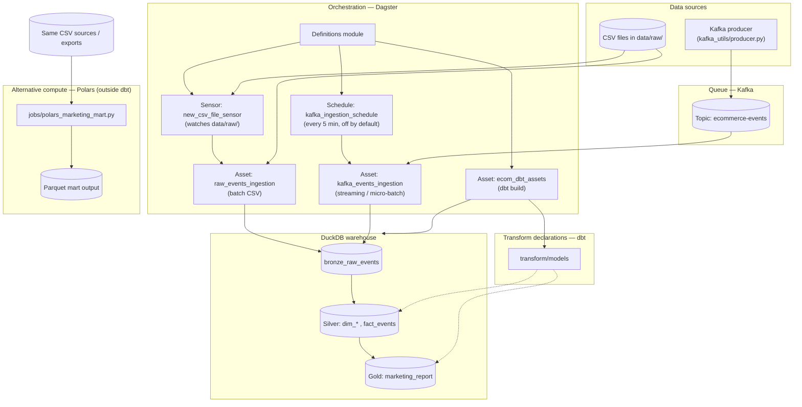

# Pipeline architecture

End-to-end flow for the ecommerce analytics pipeline: **file landing / Kafka streaming → bronze (DuckDB) → silver/gold (dbt)** with **Dagster** orchestration and an optional **out-of-warehouse** batch path using **Polars**.

Two ingestion modes coexist — **batch** (CSV files, for historical/backfill loads) and **streaming** (Kafka topic, for incremental fresh data). Both write to the same `bronze_raw_events` table; downstream dbt models are agnostic to the ingestion source.

## Layers

| Layer | Technology | Role |
|-------|------------|------|
| Queue | Kafka (Docker) | Decouples producers from the warehouse; supports real-time and micro-batch ingestion alongside traditional CSV batch loads. |
| Orchestration | Dagster | Schedules/runs assets, UI lineage. **Sensor** auto-triggers batch ingestion on new CSV files; **schedule** polls Kafka topic periodically. |
| Bronze | DuckDB + Python | Append-only raw events with file name / batch id and ingest timestamp. Fed by **batch** (CSV) or **streaming** (Kafka) path. |
| Silver | dbt | Conformed dimensions and `fact_events` (incremental append + anti-join on `event_id`). |
| Gold | dbt | `marketing_report` mart — incremental merge, recomputes affected dates from silver. |
| Alt. engine | Polars | Same grain mart from CSV → Parquet without going through the warehouse (batch / scale-out friendly). |

## Ingestion modes

| Mode | When to use | Trigger |
|------|-------------|---------|
| **Batch (CSV)** | Historical / backfill loads, large datasets that are impractical to stream. | Drop CSVs in `data/raw/` → `new_csv_file_sensor` auto-triggers, or materialize `raw_events_ingestion` manually. |
| **Streaming (Kafka)** | Incremental fresh data arriving continuously or in small batches. | Run producer → Kafka topic → `kafka_ingestion_schedule` (or materialize `kafka_events_ingestion` manually). |

Both paths are always available. Use batch for the initial historical load, then switch to (or add) Kafka streaming for ongoing incremental data.

## Idempotency (design intent)

- **Bronze (batch):** skip a file if `_file_name` is already present (no duplicate load of the same source file).
- **Bronze (Kafka):** consumer group offset tracking prevents re-processing committed messages.
- **Silver fact:** `incremental_strategy='append'` with `NOT EXISTS` on `event_id` to avoid duplicates with lower memory usage on large batches.
- **Gold:** incremental merge on `(report_date, brand, category_l1)` — affected dates recomputed fully from silver.

See the root `README.md` for run commands and verification.
