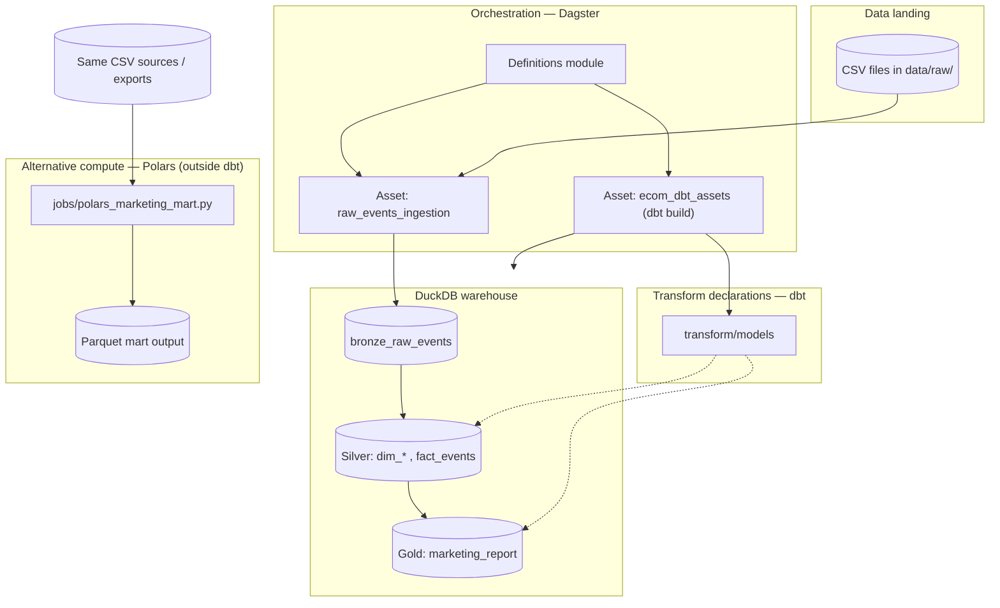

# Pipeline architecture

End-to-end flow for the ecommerce analytics pipeline: **file landing → bronze (DuckDB) → silver/gold (dbt)** with **Dagster** orchestration and an optional **out-of-warehouse** batch path using **Polars**.

## Layers

| Layer | Technology | Role |
|-------|------------|------|
| Orchestration | Dagster | Schedules/runs assets, UI lineage, ties ingestion to dbt. |
| Bronze | DuckDB + Python | Append-only raw events with file name and ingest timestamp. |
| Silver | dbt | Conformed dimensions and `fact_events` (incremental merge on `event_id`). |
| Gold | dbt | `marketing_report` mart — full table rebuild from silver for stable aggregates. |
| Alt. engine | Polars | Same grain mart from CSV → Parquet without going through the warehouse (batch / scale-out friendly). |

## Idempotency (design intent)

- **Bronze:** skip a file if `_file_name` is already present (no duplicate load of the same source file).
- **Silver fact:** `incremental_strategy='merge'` on `event_id` so reprocessed keys upsert instead of duplicating rows.
- **Gold:** `materialized='table'` — full recompute from current silver; deterministic for a fixed silver state.

See the root `README.md` for run commands and verification.
